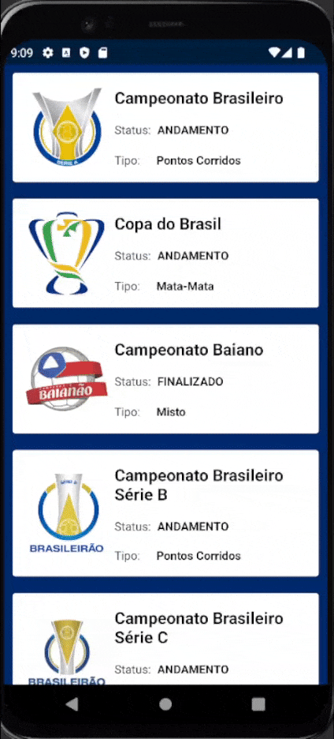
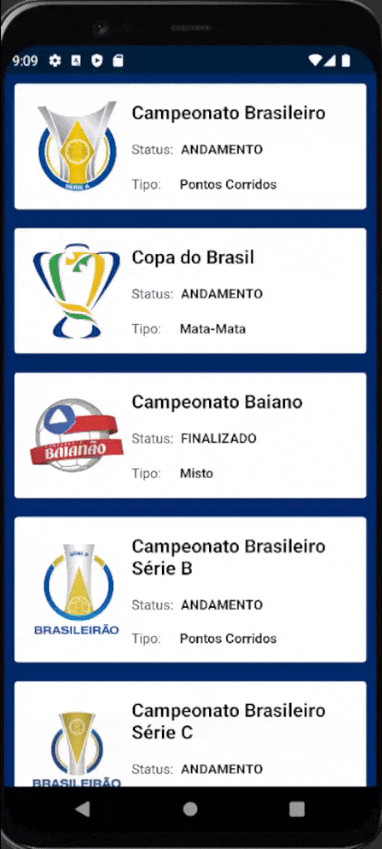
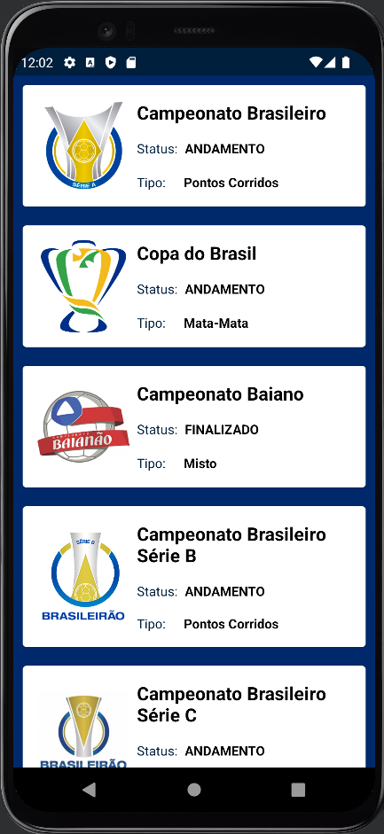
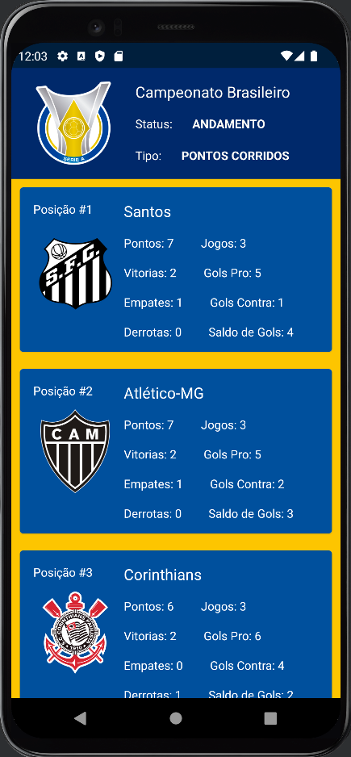

# FuteProject
Um aplicativo android desenvolvido em Kotlin que disponibiliza listas e tabelas de campeonatos de futebol através do consumo de api.

## Arquitetura utilizada
    MVP ( Model View Presentation )

## Bibliotecas utilizadas

- Retrofit2

- Glide

- Coin

## Api utilizada

    https://www.api-futebol.com.br
    
### Observação sobre Api utilizada

Ao consumir a Api acima, através do cadastro de um plano gratuito, foi somente possível obter a tabela de um campeonato, o único campeonato da tabela que disponibiliza de uma tabela de pontos.

## Demonstração
    O aplicativo possui duas telas, uma contendo a lista dos campeonatos disponíveis, e outra, após selecionar um campeonato, 
    contendo a tabela de pontos dele, se o mesmo possuir uma tabela de pontuação.
    
### Lista de campeonatos

     

### Tabela de um campeonato

   

    Obs: A qualidade do vídeo está parcialmente comprometida devida a falta de uma boa placa de video no meu computador durante a gravação das telas, assim pode ter    uma sensação de lentidão, porém o aplicativo por si só está muito perfomatico.

## Screenshots

   
   

